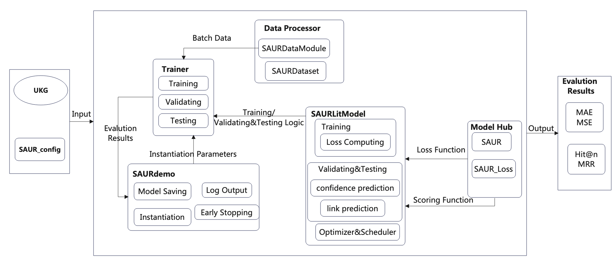

# unKR: A Python Library for Uncertain Knowledge Graph Reasoning by Representation Learning
<p align="center">
    <a href="https://pypi.org/project/unKR/">
        
    </a>
    <a href="https://github.com/seucoin/unKR/blob/main/LICENSE">
        
    </a>
    <!-- <a href="">
        
    </a> -->
    <a href="https://seucoin.github.io/unKR/">
        
    </a>
</p>

SAUR model is a complex model for uncertain knowledge graph inference, which combines BERT model, Graph Convolutional Network (GCN), Long Short Term Few Pages Network (LSTM), and was proposed by Zhao et al. (2025). And unKR is a UKG inference toolkit that has integrated nine UKG inference models proposed in recent years. It provides a unifying workflow to implement a variety of uncertain knowledge graph representation learning models to complete UKG reasoning. This project integrates the SAUR model into the unKR toolkit using [PyTorch Lightning](https://www.pytorchlightning.ai/) and pyTorch frameworks. The integrated SAUR model is trained on the data set provided by unKR, and the performance optimization of the SAUR model is realized.

<h3 align="center">
    
</h3>
<!-- <p align="center">
    <a href=""> </a>
<p> -->


## Datasets
unKR provides three public UKG datasets including CN15K, NL27K, and PPI5K. The following table shows the source, the number of entities, relations, and facts of each dataset.

| Dataset |   Source   | #Entity  | #Relation | #Fact |
|:-------:|:----------:|:---------:|:---------:|:-----------:|
|  CN15K  | ConceptNet |   15000   |    36     |   241158    |
|  NL27K  |    NELL    |   27221   |    404    |   175412    |
|  PPI5K  |   STRING   |   4999    |     7     |   271666    |
                                                                                                                                                 |

## Reproduced Results
unKR determines two tasks, confidence prediction and link prediction, to evaluate models' ability of UKG reasoning. For confidence prediction task, MSE (Mean Squared Error) and MAE (Mean Absolute Error) are reported. For link prediction task, Hits@k(k=1,3,10), MRR (Mean Reciprocal Rank) under both raw and filterd settings are reported. In addition, we choose high-confidence (>0.7) triples as the test data for link prediction.

Here are the reproduce results of SAUR model on cn15k,nl27k,ppi5k datasets with unKR. 

### Confidence prediction
<table>
    <thead>
        <tr>
            <th>Model</th>
            <th>MSE</th>
            <th>MAE </th>
        </tr>
    </thead>
    <tbody align="center" valign="center">
        <tr>
            <td>cn15k</td>
            <td>0.0688 </td>
            <td>0.1676  </td>
        </tr>
        <tr>
            <td>nl27k</td>
            <td>0.0143 </td>
            <td>0.0445  </td>
        </tr>
        <tr>
            <td>ppi5k</td>
            <td>0.0034 </td>
            <td>0.0341  </td>
        </tr>
    </tbody>
</table>

### Link prediction
<table>
    <thead>
        <tr>
            <th>Model</th>
            <th>MRR</th>
            <th>Hits@1</th>
            <th>Hits@3</th>
            <th>Hits@10</th>
        </tr>
    </thead>
    <tbody align="center" valign="center">
        <tr>
            <td>cn15k</td>
            <td>0.135 </td>
            <td>0.106 </td>
            <td>0.154 </td>
            <td>0.209 </td>
        </tr>
        <tr>
            <td>nl27k</td>
            <td>0.461 </td>
            <td>0.349 </td>
            <td>0.496 </td>
            <td>0.547 </td>
        </tr>
    </tbody>
</table>

<br>

## Usage

### Installation

**Step1** Create a virtual environment using ```Anaconda``` and enter it.

```bash
conda create -n unKR_SAUR python=3.9
conda activate unKR_SAUR
```

**Step2**  Install package.
+ Install from source
```bash
git clone https://github.com/bleakdebug/czy_demo.git
cd unKR_SAUR
pip install -r requirements.txt
python setup.py install
```

### Data Format
For SAUR model, `train.tsv`, `val.tsv`, and `test.tsv` are required. 

- `train.tsv`: All facts used for training in the format `(h, r, t, s)`, one fact per line.

- `val.tsv`: All facts used for validation in the format `(h, r, t, s)`, one fact per line.

- `test.tsv`: All facts used for testing in the format `(h, r, t, s)`, one fact per line.


### Parameter Setting
You can set up parameters by [config](https://github.com/bleakdebug/czy_demo/tree/main/config) file. 


### Model Training
```bash
python SAURdemo.py --load_config --config_path <your-config>
```

### Model Testing
```bash
python SAURdemo.py --test_only --checkpoint_dir <your-model-path>
```


